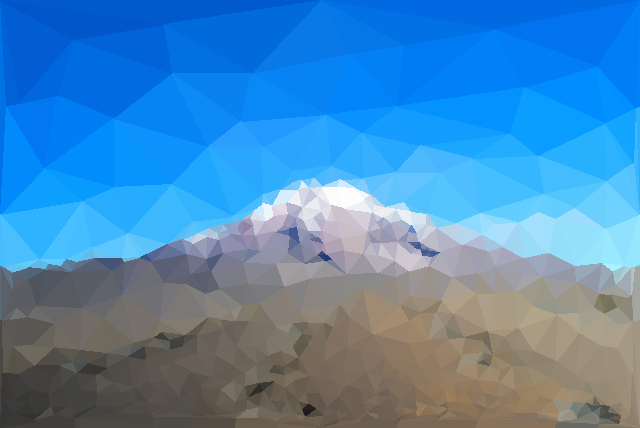

# Subdivide



A python script to create colored triangular meshes from images.

## Installation
You'll need to install OpenCV with python bindings. I.e.
``` sh
sudo apt-get install python-opencv
```

Additionally, install the python packages for click and numpy.

## Usage

``` sh
./subdivide.py --until-distance=900 --interactive <some-image-file>
```

